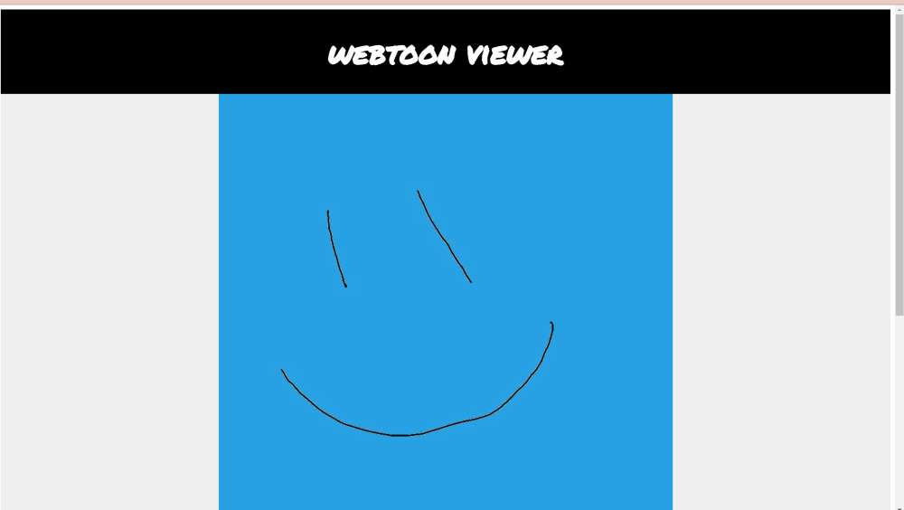

# Webtoon Viewer

I made this tool to help me locally check my webtoon scrolling content. Width on PC will default to 800 as per Webtoons specs. On mobile it will enlarge the images to 100% width of the screen.

Make sure your images are numbered in order (i.e. image1.jpg, image2.jpg ...)


### What does it do?
You give it a folder (i.e. --folder <your image folder>) and it will take all those images and generate an html that links all your images to specs of webtoon (800px width). Next it will spin up a local server defaulted on port 8080 so that you can view it in your browser. If you only want to build just give it the build option (i.e. --build). If you only want to serve your html give it the serve option (i.e. --serve).

Note: I wrote this in 2 hours so it's not perfect. feel free to make edits.



## Installing rust:
Go here: [https://www.rust-lang.org/tools/install](https://www.rust-lang.org/tools/install)

## Running everything locally
`cargo run -- --folder test --all`

```
Usage: WebtoonPrepView.exe [OPTIONS] --folder <FOLDER>

Options:
  -f, --folder <FOLDER>  Directory where the images are located on your computer
  -d, --dest <DEST>      Folder name you wish to specify relative to index.html. Default value is "img" (i.e http://localhost:8080/img) [default: img]
  -b, --build            Build the html page
  -s, --serve            Spin up a simple http server to show the html page in a browser
  -a, --all              Build the html page and spin up a simple http server to view the page in a browser
  -p, --port <PORT>      Specify the http port to serve. Default is port 8080 (i.e. http://localhost:8080) [default: 8080]
  -h, --help             Print help
  -V, --version          Print version
  ```

## How to view from your PC
### Windows:
1) Run WebtoonPrepView
2) On your PC browser navigate to http://<youripv4address>:8080 (i.e. http://192.168.1.73:8080)

## How to view from the mobile browser
### Windows:
1) Disable your private network firewall or allow the app through when prompted.
2) Open cmd.exe and run `ipconfig /all` to find your Ipv4 Addres for Wifi (i.e 192.168.1.73)
3) Run WebtoonPrepView
4) On your phone browser navigate to http://<youripv4address>:8080 (i.e. http://192.168.1.73:8080)
5) It should display on your browser.